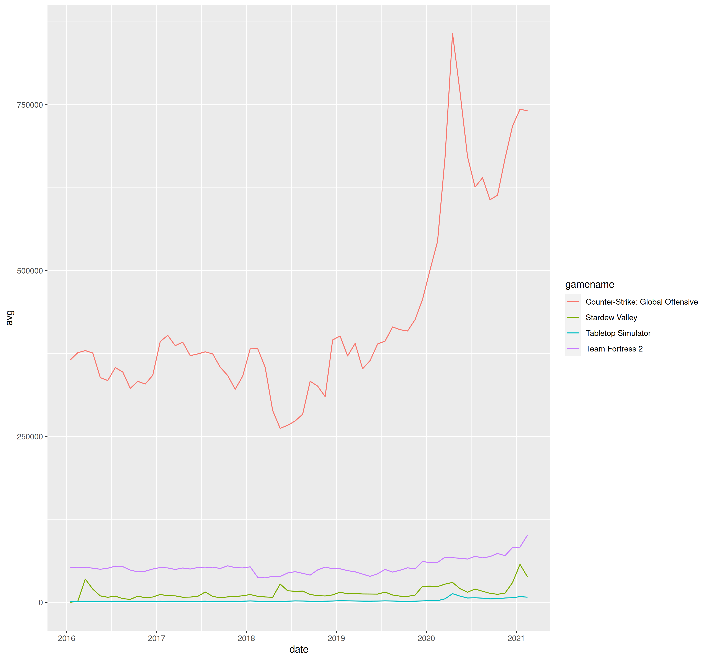

```{r setup, include=FALSE}
knitr::opts_chunk$set(echo = TRUE)
options(digits = 3)
```

```{r load-sas-libraries, echo = F, message = F, warning = F}

library(SASmarkdown)
sas_enginesetup(sashtml=sashtml)

sasexe <- "C:/Program Files/SASHome/SASFoundation/9.4/sas.exe"
sasopts <- "-nosplash -ls 75"

# Linux options (for grading, please leave this in!)
sasexe <- "/usr/local/SASHome/SASFoundation/9.4/bin/sas_en"
sasopts <- "-ls 75"
```

## Instructions

Make sure you edit the author name at the top of the document. 

When you are finished with the assignment: 

1. Save the file as 04_Lastname_Firstname.Rmd and compile it
2. Commit the Rmd file and corresponding html file to your homework git repo
3. Push the commit to github
4. Locate the Rmd file on github and click on the SHA link for the file
5. Paste the url of the resulting page into Canvas to submit your assignment.

Your assignment must compile on a different computer as long as the saspath is set correctly for that machine.

## Steam Games

This week's homework data is from TidyTuesday, an organization that provides datasets every Tuesday for people to practice their data tidying and manipulation skills. See the [readme](https://github.com/rfordatascience/tidytuesday/blob/master/data/2021/2021-03-16/readme.md) for more information.

**Data Dictionary**

|variable      |class     |description |
|:-------------|:---------|:-----------|
|gamename      |character | Name of video games |
|year          |double    | Year of measure |
|month         |character | Month of measure |
|avg           |double    | Average number of players at the same time|
|gain          |double    | Gain (or loss) Difference in average compared to the previous month (NA = 1st month) |
|peak          |double    | Highest number of players at the same time |
|avg_peak_perc |character | Share of the average in the maximum value (avg / peak) in % |

```{r steam-games-data-setup}
games <- readr::read_csv('games.csv')
```

### R: Replicate the plot

Your first goal (in R) is to get to this graph by breaking down the problem (replicating the graph) into smaller steps that make sense and that you can accomplish piece-by-piece.



Useful hints:

1. `month.name` is a vector containing month names that you can use to create a factor variable. Factor variables can be easily converted into numeric variables. This might help you get a numeric month, which might help you get to a fractional year.

2. `subset()` is a function that will subset a data frame based on a logical condition. It might be easier to use than logical indexing (though you can use either)

3. To get a line graph in ggplot2, use `geom_line()`. Using `aes(color = varname)` will color the lines by variable name.


#### Problem Steps

Make a list of steps that will be necessary to get the data you have into this form.    
<br/>
1. Read the data.  
2. Built a new dataset for needed gamenames.    
3. Change date form into standard dateform by *lubridate* package.  
4. plot lineplots with correct label form.  


#### Problem Code
Provide code chunks that sequentially work through your list of steps to produce the graph.

```{r}
# Code for step 1 goes here
games <- readr::read_csv('https://raw.githubusercontent.com/rfordatascience/tidytuesday/master/data/2021/2021-03-16/games.csv')
head(games)
```
#### Build a new dataset to include the information for needed games
```{r}
library(lubridate)
plot_game <-data.frame()

plot_names <- c('Counter-Strike: Global Offensive', 'Stardew Valley', 'Tabletop Simulator', 'Team Fortress 2')


for (i in 1:4){
  result <- games[games$gamename==plot_names[i],]
  plot_game <- rbind(plot_game, result)
}
plot_game[(plot_game$gamename=='Counter-Strike: Global Offensive'& plot_game$year==2021),]

```
#### Create a variable **date** storing *ymd* type data
```{r}
plot_game$month_ <- paste(plot_game$year,match(plot_game$month,month.name),'01')

plot_game$date <- ymd(plot_game$month_)
```
#### Keeping the data after 2016 for replicating the plot
```{r}
plot_game_2016 <- plot_game[plot_game$year>=2016,]
```

#### Plot lineplots relabel x-axes with *break*.
```{r}
library(ggplot2)
ggplot(data=plot_game_2016,
       aes(x=date, y=avg,
           group=gamename, color=gamename, shape=gamename))+
  geom_line()+
  xlab('Date')+
  ylab('Average')+
  scale_x_date(name='Date', date_breaks = '1 year', date_labels = '%Y', date_minor_breaks = '1 year', expand = c(0,0))


```


### SAS: Popular Games

In SAS, I'd like you to look at the games data set slightly differently - can you figure out which games were at the height of their popularity in March 2020?

If you are not using SASMarkdown, then please edit the games.sas file instead and delete the chunk below.


Useful hints: 

1. I found PROC Rank to be very helpful here

2. The clause (where=(rank=1)) will save only data where the rank is 1 when used with an OUT statement

3. You can print data using a where statement as well!


#### Problem Steps
Make a list of steps below that will be necessary to get the data you have into this form.    
1. Change the type of avg into numeric data for ranking.  
2. Select all the data of March 2020 and save then in a dataset called Mar_2020.  
3. Ranking the data and print the top 10.  

#### Problem Code
Provide code that sequentially works through your list of steps to produce the necessary table of games. 

This code can be provided in code chunks or in a sas file, but it must run reproducibly, assuming the sas code is run with the working directory of this project.


